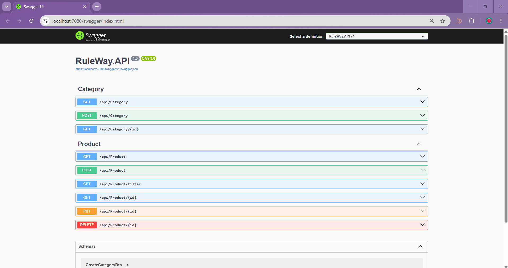

# RuleWay Product Management API
RuleWay is a simple product management API developed with ASP.NET Core Web API.
The project provides CRUD operations for products, category management, product filtering and stock-based live status control.


## Technologies
- .NET 8
- ASP.NET Core Web API
- Entity Framework Core
- SQL Server
- Swagger
- Onion Architecture

## Project Structure
- RuleWay.API
- RuleWay.Application
- RuleWay.Domain
- RuleWay.Persistence
- RuleWay.Infrastructure


## Business Rules
- Product title cannot be empty.
- Product title cannot be longer than 200 characters.
- A product can have only one category.
- A product without a category cannot be live.
- Each category has its own minimum stock quantity.
- A product cannot be live if its stock quantity is below the minimum stock quantity of its category.


## Product Endpoints
- `GET /api/Product`
- `GET /api/Product/{id}`
- `POST /api/Product`
- `PUT /api/Product/{id}`
- `DELETE /api/Product/{id}`
- `GET /api/Product/filter`
 

## Category Endpoints
- `GET /api/Category`
- `GET /api/Category/{id}`
- `POST /api/Category`


## Filtering
Products can be filtered by keyword and stock range.


Example:
```text
GET /api/Product/filter?keyword=mouse&minStock=5&maxStock=20
```

## Screenshots

### API Endpoints


### Product Without Category


### Keyword Filter Results


### Keyword Filter


### Keyword Filter Results


### Stock Range Filter


### Delete Product

